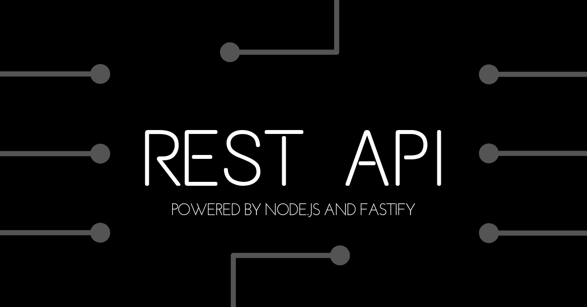

# Build a REST API powered by Node.js and Fastify


<h3>Tutorial found here</h3>
https://zeroequalsfalse.press/posts/build-rest-api-in-5-minutes/

<h3>Download</h3>

```
git clone https://github.com/majikarp/node-rest-api-template
```

<h3>Installation</h3>

```
npm install
```

```
node index.js
```

<h3>Software</h3>

[Node.js](https://nodejs.org/en/)<br>
[Fastify](https://fastify.io/)<br>

<h3>Benefits</h3>

- Create an application with easy integration to third-party software from the web.
It uses node-package-manager - which is the largest software registry in the world.
You can search available integrations on their website here:
[Node Registry](https://www.npmjs.com/)

- Fastify is a low-overhead framework and 20% faster than Express

- Maintains the Benefits of RESTful Architecture

<h3>Done with your app?</h3>

- Deploy to the Cloud - [AWS](https://aws.amazon.com/getting-started/projects/deploy-nodejs-web-app/)

<h3>Thank you!</h3>

Thank you for choosing this template - currently taking pull requests for improvements. If you like the template, don't forget to leave a star! Happy coding
